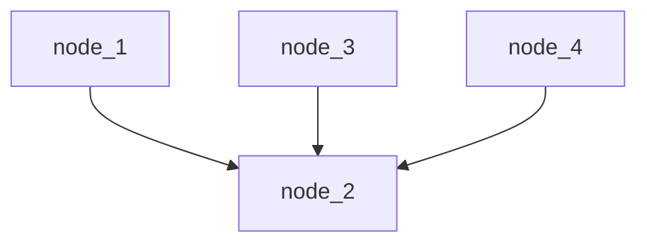

test du **readme** ~~editor~~

comme tu peux le voir **ca fonctionne bien** !!!

```
fzzffeezzeffe/
│   └── 1
3
```

Hello je fait un test

blablablablablablablablablablablablablablablablablablablablablablablablablablablablablablablablablablablablablablablablablablablablablablablablablablablablablablablablablablablablablablablablablab

---

lablablablablablablablablablablablablablablablablablablablablablablablablablablablablablablablablablablablablablablablablablablablablabla

**dossier** :

```
Folder_1/
│   └── file_1
Folder_2/
│   └── file_2
Folder_3/
│   └── file_3
file_4
```

je suis laddd



hello testtest